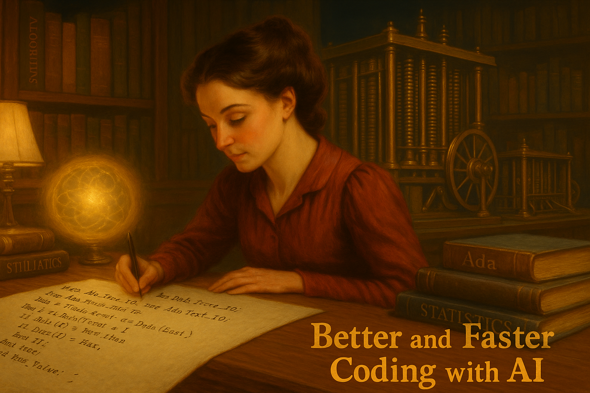

# AI for Coding — A Primer

A quick lap around using AI for code, before we go any further. If you have used Copilot, ChatGPT for a function, or paired with an LLM on a script, this is review. If not, it sets the floor for everything that follows.

::: {.callout-warning}
## Content moved
The **Creating Graphs** exercise and **US Earnings (CPS)** case study material have moved to [Week 06: From Data to Report](../week06/index.html).
:::

:::::: {.hero-section}
::::: {.container}
::: {.hero-title}
Week 00: AI-Assisted Coding Prep
:::

::: {.hero-subtitle}
Boosting coding for data analysis with AI tools
:::
:::::
::::::

------------------------------------------------------------------------



## Learning Objectives

By the end of this session, students will:

-   Understand how AI transforms coding workflows for data analysis tasks
-   Learn effective prompting strategies for data analysis code generation
-   Experience key AI coding tools: ChatGPT Canvas, Claude Projects, GitHub Copilot
-   Practice AI-assisted coding for common data analysis tasks
-   Set up integrated development environments with AI assistance
-   Focus on R and Python. 

## Preparation / Before Class

::::: {.week-card .card}
::: card-header
🔧 **Tool Setup**
:::
::: card-body

**Required Access:** 

- ChatGPT account (free tier sufficient for testing) 
- Claude account (free tier sufficient)

**Recommended Setup:** 

- GitHub account for Copilot (free for students) 
- VSCode, RStudio, or Jupyter Notebook installed 
- Your preferred data analysis language ready (R/Python)
- You can you a great deal of this for other languages like SQL, Stata or Julia.

**Optional but Valuable:** 

- Cursor AI editor (free trial available)

:::
:::::

## Class Material

::::: {.week-card .card}
::: card-header
🤖 **Why AI + Data Analysis Coding Works (20 min)**
:::

::: card-body
**Covers key set of tasks:**

-   **Repetitive patterns:** Data analysis has common workflows (load → clean/wrangle → analyze → visualize)
-   **Well-documented libraries:** pandas, scikit-learn, as well as dplyr, ggplot2, are extensively covered in AI training data (had been in use for a while). With updates, it knows more recent libraries from tensorflow to fixest (R)
-   **Clear intentions:** "Create a scatterplot with regression line" is specific enough for good code generation. Well established "good practice"
-   **Iterative nature:** Data analysis involves lots of tweaking and refinement -- chat aspect helpful.

**What AI Excels At:**

-   Well defined code chunks and setup (libraries, dependencies)
-   Syntax, how exactly do certain coding tasks (such as regex, loops)
-   Standard statistical procedures
-   Data manipulation and cleaning
-   Basic visualization code

**Human Oversight and Decisions are Needed:**

-   Most code
-   Research design decisions
-   Statistical / econometric interpretation
-   Domain-specific logic
-   Finalize question (vs bland suggestions)
-   Quality control and validation
:::
:::::

::::: {.week-card .card}
::: card-header
📝 **Effective Prompting for Data Analysis (25 min)**
:::

::: card-body
**Model Recommendations:**

* ChatGPT 4o / Claude Sonnet 4. works about equally fine. 


### Prompting Best Practices

Some ideas to help get the code do what you want, or at least close enough. 

**Be specific**

-   **Be specific about libraries:** "Using pandas and seaborn..." vs. "Using R and ggplot2..."
-   **Include data structure:** "DataFrame with columns: date, price, volume"
-   **Specify output format:** "Save as PNG for publication" or "Return as tidy data table" or "give back markedown (latex) text with equations"

**Define language, preferences**

- I use R and tidyverse, so unless specified, use that
- I use Python, and when possible prefer polars to pandas
- Ask for comments: "Include detailed comments explaining each step"


**For frequent tasks, AI will know which library to use in a language**

- **Filter on size<5** -- will do it in Python Pandas as default.  
- **Scatterplot of sales and employment** -- Will do it seaborn / matplotlib or ggplot in R. 

**Advice include data structure** 

- If possible upload the data
- if not, upload a small bit of data, like 1/1000 random sample
- Start with creating a data dictionary (see also [class 3](/week03))

### Example prompts

You can experiment with a vague prompt or being specific. 

**Example Prompt 1: broad**

```         
"Here is some sales data, summarize regional variation."
```

vs

**Example Prompt 2: with details**

```         
"Create Python (R) code using pandas (dplyr) to:

1) Load CSV with columns id, date, sales, region
2) Filter for 2023 data  
3) Group by region and calculate mean sales
4) Create a bar chart with plotnine / ggplot2"
```

What are the pros and cons of each?

### Some tasks where AI works well


*1. Data Cleaning Pipeline
*2. Exploratory Data Analysis
*3. Statistical Modeling
*4. Machine Learning Pipeline

:::
:::::


::::: {.week-card .card}
::: card-header
**Creating Graphs exercise (40 min)**
:::

::: card-body

This exercise has moved to [Week 06: From Data to Report](../week06/index.html). See the full [Creating Graphs walkthrough](/da-knowledge/creating-graphs.html).

:::
:::::


## Setting up tool

::::: {.week-card .card}
::: card-header
🛠️ **AI Coding Tools Showcase (30 min)**
:::

::: card-body
**ChatGPT Tools:**

-   **Canvas:** Collaborative coding environment for iterative development
-   **Advanced Data Analysis:** Upload datasets, generate analysis with code execution
-   **GPT-4.1:** Optimized specifically for coding tasks

**Claude Tools:** 

- **Projects:** Upload full datasets and documentation for context-aware coding 
- **Artifacts:** Code generation with real-time preview and editing 
- **Claude 4 Sonnet:** Strong reasoning for complex analytical workflows

**Specialized Coding Tools:** 

- **GitHub Copilot:** Inline code completion integrated into your existing editor 
- **Cursor AI:** AI-first code editor with context-aware suggestions 
- **Replit:** Browser-based coding with AI assistance

**Hands-on Demo:** 

- Upload sample dataset to ChatGPT Advanced Data Analysis 
- Create Claude Project with course data 
- Compare code generation approaches
:::
:::::


::::: {.week-card .card}
::: card-header
⚡ **GitHub Copilot Integration (20 min)**
:::

::: card-body
**Setup in Different Environments:**

**VSCode:**

-   Install GitHub Copilot extension
-   Authenticate with GitHub account
-   Use Ctrl+Space for suggestions, Tab to accept

**Jupyter Notebook:**

-   Install via VS Code Jupyter extension or JupyterLab extension
-   Inline suggestions while typing
-   Copilot Chat for longer explanations

**RStudio:**

-   Enable GitHub Copilot in Global Options \> Code \> Completion
-   Works with R scripts and R Markdown
-   Suggests tidyverse and base R patterns

**Workflow Best Practices:**

-   Write descriptive comments before code blocks
-   Use meaningful variable names to guide suggestions
-   Accept suggestions, then modify as needed
-   Use Copilot Chat for explanations and debugging
:::
:::::


## Discussion Questions

**Reflection:**

-   Which AI tool felt most natural for your coding style?
-   Where did AI suggestions surprise you (positively or negatively)?
-   How might this change your typical data analysis workflow?
-   What validation steps would you add when using AI-generated code?


## Background, Tools and Resources

**Getting Started:** 

- [GitHub Student Pack](https://education.github.com/pack) -- Free Copilot access 
- [Cursor AI](https://www.cursor.com/) -- AI-first code editor 
- [OpenAI Codex Cookbook](https://github.com/openai/openai-cookbook) -- Advanced prompting examples

**Key Insight:** AI coding assistance is most powerful when you understand the underlying concepts. Use AI to accelerate implementation, not replace understanding.

**Next Week:** [Week 1 - LLM Review](../week01/) where we'll explore broader AI concepts for data analysis.

## Some personal comments on AI and this class

-   While this class is called week00, it was created last. You may have guessed righ.
-   AI (Claude 4.0) created a great deal of this class following a [detailed prompt](assets/week00-ask-ai). I also asked whether to keep it as week00 or change all numbering. Great answers.

