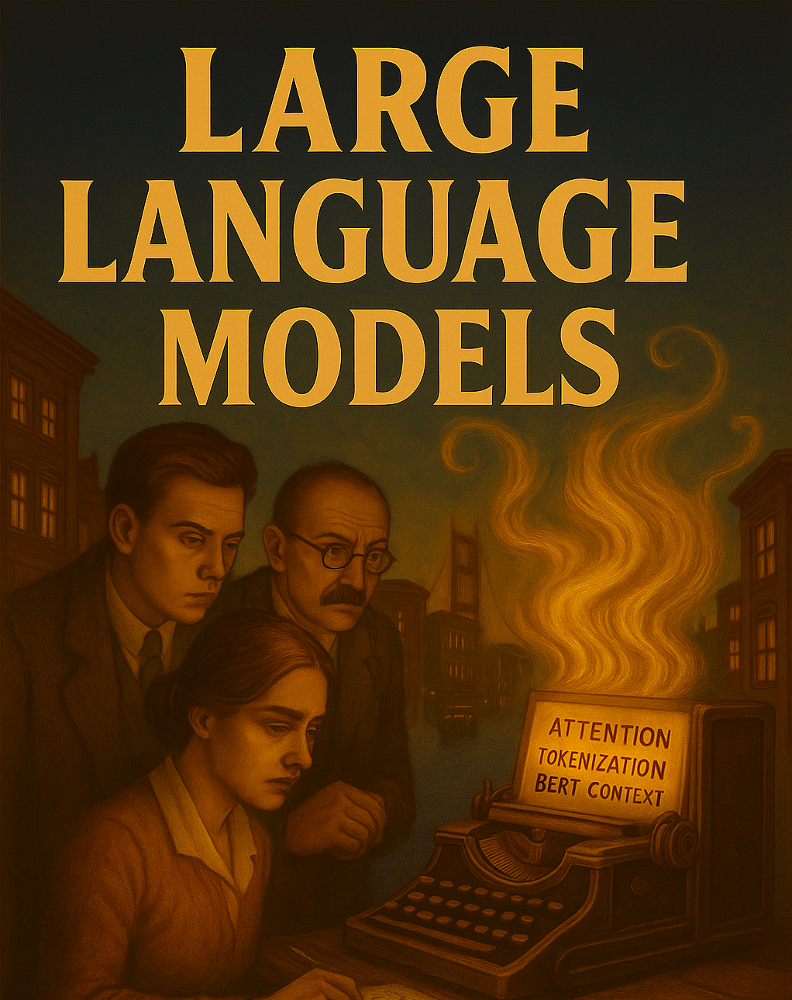

# What LLMs Are (and Aren't)

Before you can collaborate with an AI, you need a working mental model of what it is. Not a deep technical one — a *useful* one. Enough to predict where it will be brilliant, where it will hallucinate, and which decisions stay yours.

This chapter introduces the core ideas — tokens, context, training, the "jagged frontier" of capabilities, and the *Cyborg vs. Centaur* metaphor for working with AI. By the end you should be able to look at a task and form an opinion, before you prompt, about whether AI will help, hinder, or mislead.

The chapter draws on the original Week 1 material from the course; the practical reflection exercise lives in [Lab 1](../labs/lab-01.qmd).

::: {.callout-note}
## For instructors
This chapter folds in the Week 1 course material. The original page lives at `week01/index.qmd` in the course repository.
:::

::: {.hero-section}
::: {.container}
::: {.hero-title}
Week 01: LLM Review
:::
::: {.hero-subtitle}
Introduction to Large Language Models and their applications in data analysis
:::
:::
:::

---




## Learning Objectives

By the end of this session, students will:

- Understand core concepts of large language models (LLMs)
- Distinguish between "Cyborg" and "Centaur" approaches to AI collaboration
- Experience the "jagged frontier" of LLM capabilities through hands-on practice
- Critically assess capabilities and limitations of AI tools in academic contexts

## Preparation / Before Class

::: {.week-card .card}
::: {.card-header}
📚 **No Required Reading**
:::
::: {.card-body}
**This is Week 1** - come ready to explore and discuss!

 **Reflection Preparation:**

- Think about your current experience with AI tools (if any)
- Consider examples where you've encountered AI in your work/studies
- Identify one data analysis task you find time-consuming or repetitive

**Optional Background:**

- Ethan Mollick: "Co-Intelligence: Living and Working with AI" (Chapters 1-2)
:::
:::


## Class Material

::: {.week-card .card}
::: {.card-header}
📊 **Core LLM Concepts (60 min)**
:::
::: {.card-body}
**[Slideshow: LLM Concepts and Applications](https://gabors-data-analysis.com/courses/da-w-ai-2025/da-w-ai-01-llm-course.html)**

**Key Topics Covered:**

- **What are LLMs?** Statistical models predicting next tokens from massive training data
- **The Transformer Revolution:** How 2017's "Attention is All You Need" changed everything
- **Context Windows:** why this matters for data analysis
- **Training Process:** Resources and human feedback
 - **Collaborative Frameworks:** How to integrate human and AI work

:::
:::


::: {.week-card .card}
::: {.card-header}
🔧 **Hands-on: Data search (15 min)**
:::
::: {.card-body}

**Example**

Try this in a chat

```
Get me an income dataset by planning regions (county) in Connecticut for 2023. Present the results as a table I can copy and edit..
```

* Now try find the actual data and compare. 
* Try multiple times in different models
* Try modifying the prompt to be more specific or different


:::
:::


## Discussion Questions

**End of Week Reflection:**

1. **Personal AI Experience:** How have you already incorporated AI into your routine? Which model feels most natural to you?

2. **Error Management:** How do you currently deal with AI hallucinations or imperfect answers?  What strategies emerged during the FT graph exercise?

3. **The Jagged Frontier:** What tasks do you expect AI to excel at? Where do you think it will struggle?  Did the visualization exercise match your expectations?


## Assignment

::: {.callout-note icon="📝"}
## Assignment 1: Reproduce the FT Graph

**Due:** Sunday 23.55 before Week 2 (on moodle)

[Full Assignment Details](../assignments/assignment_01.html){.assignment-badge}
:::

## Background, Tools and Resources

[AI Model Selection Guide](../da-knowledge/which-ai.html)

[Glossary of key terms](../da-knowledge/technical-terms-page.html)

### Academic Integrity and AI use

**Course Philosophy:**

- **AI as Assistant:** Use AI to enhance your capabilities, not replace your thinking
- **Maintain Authority:** You remain responsible for all outputs and interpretations
- **Verify Everything:** Always validate AI suggestions, especially statistical claims
- **Document Usage:** Keep track of how AI helped -- to learn (and for transparency)

**Red Lines:**

- Never submit unverified AI output as your own work
- Always understand the analysis you're presenting
- Avoid over-reliance on AI for critical thinking or interpretation (**you be you**)

**The Goal:** 

Become a more capable data analyst who can leverage AI tools effectively while maintaining scientific rigor.

**Next Week:** 

[Week 2 - Data Discovery and Documentation](../week02/) where we'll use AI to understand and document complex datasets.

## Read more

* [Ethan Mollick update on Jagged Frontier](https://www.oneusefulthing.org/p/the-shape-of-ai-jaggedness-bottlenecks)


## Some personal comments on AI and this class

* I needed to rewrite, edit the slideshow frequently. Bloody hell, this course material is tricky. (While [Gosset's t-test](https://en.wikipedia.org/wiki/Student%27s_t-test) has been around since 1908...)
* It was an AI (Claude Sonnet 4.0) that suggest to include the last bit on Academic Integrity and red lines. Hahh.


## AI and me — chapter reflection

Before moving on, write a short paragraph for each:

1. How did the chapter **support** my mental model of LLMs?
2. Where did it **fail** me — what is still unclear?
3. How did it **extend** me — what new question can I now ask that I couldn't before?

The next chapter, [Which AI Should I Use?](03-which-ai.qmd), gets practical: from the open zoo of frontier models, which ones are worth your money and attention?
