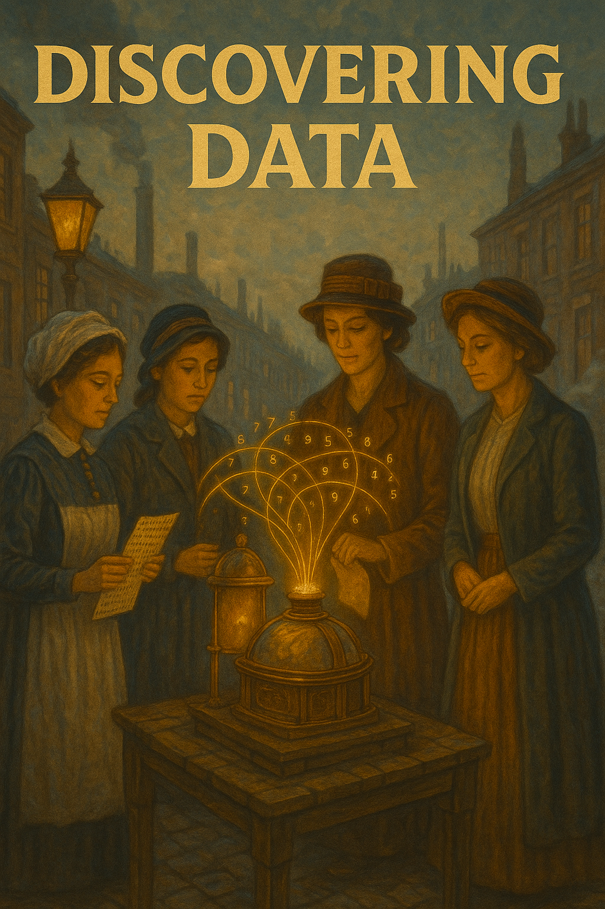

# Documenting Code and Data with AI

READMEs, data dictionaries, code-block comments — boring work that AI is genuinely good at, and that compounds over a project's life. We start the chat-workflow part here because documentation is where AI's strengths line up best with your time savings.

:::::: {.hero-section}
::::: {.container}
::: {.hero-title}
Week 02: Discovery and documentation
:::

::: {.hero-subtitle}
Starting from scratch: Data discovery and documentation with AI
:::
:::::
::::::

------------------------------------------------------------------------

# Objectives

## Summary

Sometimes data is messy and discovery is hard. Sometimes you need to write data documentation from scratch without deep knowledge of data. LLMs can help. You will learn how to write a clear and professional README. We use the 7th Wave of the World Values Survey (WVS) and rely on AI as a research assistant to bravely face a codebook with hundreds of variables.

## Learning Objectives:

-   Learn using AI with the context window effectively to understand complex data structure and do search.
-   Understand how to document a new dataset using as an example th WVS 7th wave data.
-   Create a README that describes data.
-   Learn to refine documentation by incorporating iterative feedback from peers and AI tools.
-   Develop skills in using AI to translate complex materials into accessible documentation

## Assignment 01 (Graph reproduction) Review

-   Follow instructions.
-   How to get close to original, different ways
-   How was AI assistance helpful?

## Starting presentation about prompting and context window management

[slideshow](https://gabors-data-analysis.com/courses/da-w-ai-2025/da-w-ai-02-prompting.html)

## Preparation 

::::: {.week-card .card}
::: card-header
📚 **Required Reading**
:::

::: card-body

**main**

-   Data documentation basics: [Data Documentation 101](/da-knowledge/documentation-readme.html) -- please check it out for assignment!!!!

**Background reading: **

-   Békés-Kézdi (2021) Chapters 1-3, in particular [core background info](/week02/assets/da-background.html). Focus on Chapter 2 sections on data structure and variable types - this becomes crucial when documenting data.
-   Some discussion of data types [Data Management in Large-Scale Education Research](https://datamgmtinedresearch.com/structure) by Crystal Lewis

:::
:::::

::::: {.week-card .card}
::: card-header
📊 **Data Setup**
:::

::: card-body
Access the [World Values Survey case study](/case-studies/VWS/)

1.  Download data: [WVS_random_subset.csv](/case-studies/VWS/data/WVS_random_subset2000.csv) - random subset (N=2000) - covering all countries
2.  Download its official [codebook documentation](/case-studies/VWS/data/codebook.pdf)

The full dataset is at [OSF, Gabors Data Analysis / World Values Survey](https://osf.io/mfd6s/)
:::
:::::

::::: {.week-card .card}
::: card-header
🤝 **Hands-on Documentation Workshop (50 min)**
:::

::: card-body
### No AI

-   Download and look at data and codebook
-   Start collecting some info on the data without AI
-   Start thinking about an interesting research question (find $y$ and $x$)
-   What would be next step without AI

### Understanding wih AI

-   Upload codebook (pdf) + random subset data (csv)
-   Use AI to learn about data and variables
-   Test AI's understanding: "Explain the difference between Q6 and Q7 in simple terms" - this reveals whether AI actually understands the codebook.
-   get AI help you refine the question, rethink $y$ and $x$

### AI: let AI teach you also about data

-   Start asking for help with documentation. 
-   Check how AI understands nuances of encoding
-   check consistency across variable descriptions

Always verify technical details, because AI makes *some* mistakes.

:::
:::::

## End of Week Discussion points

**End of Week Reflection:**

-   Is there any benefit of looking at it without AI?
-   What was the biggest contribution of AI?
-   First result vs after iterations -- what did improve?
-   How do you feel about learning from AI vs human instructor? Pros and cons?

**Unit tests*

- How could you design checks?

## Assignment

::: {.callout-note icon="📝"}
## Assignment 2: Creating Documentation

**Due:** Before Week 3

[Full Assignment Details](../assignments/assignment_02.html){.assignment-badge}
:::

## Some personal comments on AI and this class

-   With my Phd student, ([Zsuzsi](https://bsky.app/profile/zsuzsannavadle.bsky.social) we first developed this material in August 2024. At that time, there were many hiccups in variable understanding and selection. I was gonna suggest careful human oversight. By the time of first teaching it in February 2025, AI got extremely good at reading a 400 page codebook. By 2026 it could work with larger material and more or larger files.

